Part1

1-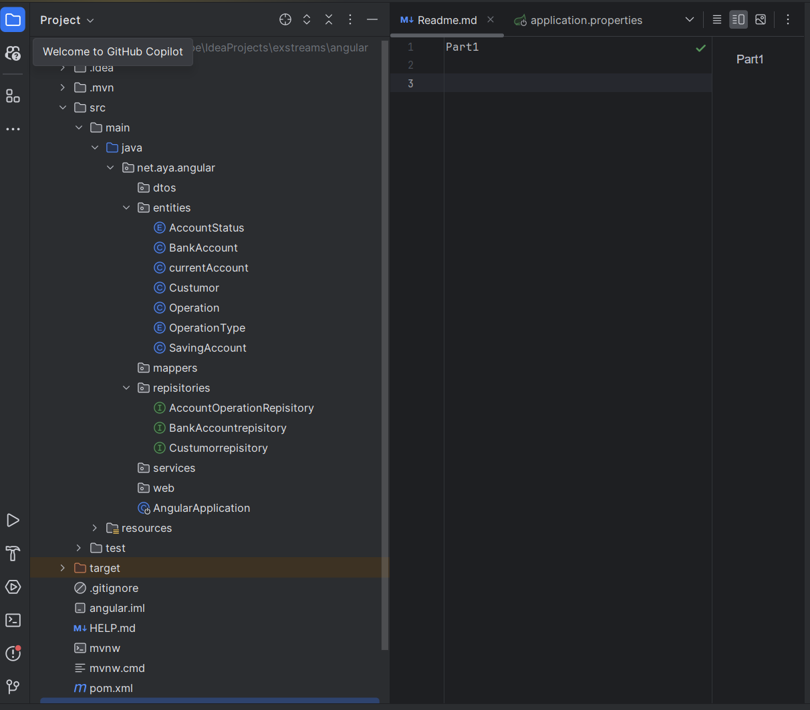
2-
savingaccount

operationtype

accountstatus
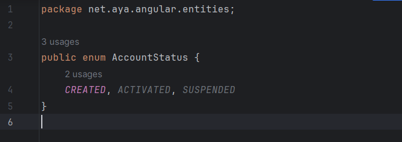
Current account

custumor
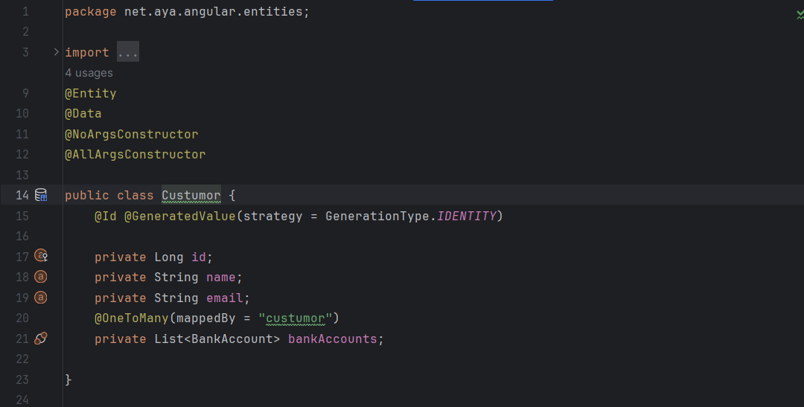
operation

bankaccount
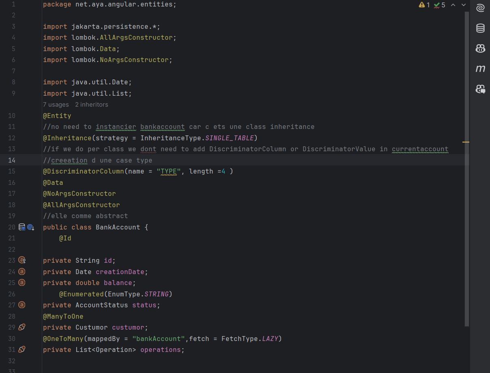
partie properties

3-

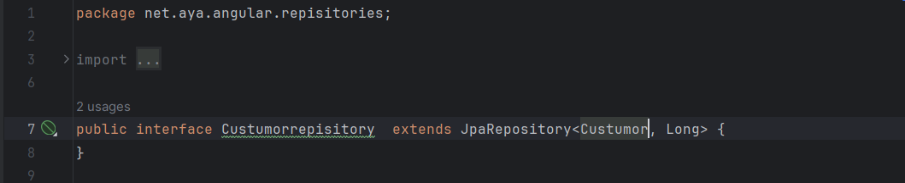
4-Test
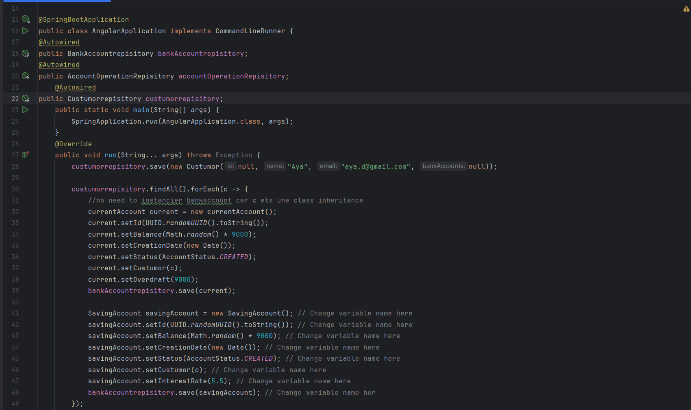
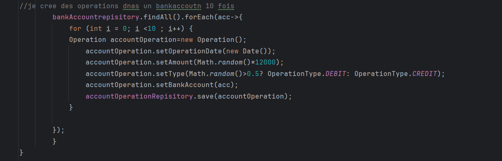
<h2>dans H2</h2>
bankaccount

custumor

operation 

Avec SQL
partie properties

exec
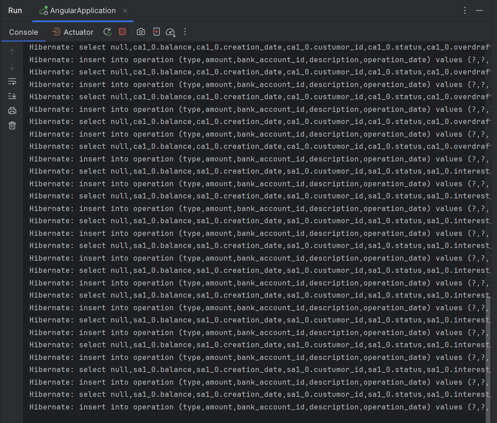
bdd
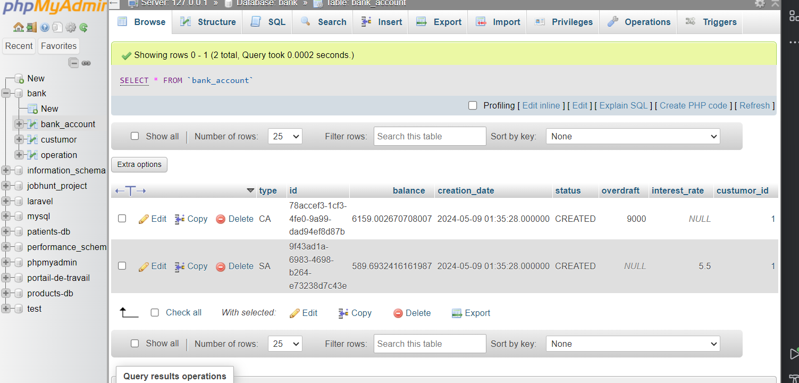

<h1>Partie2</h1>
couche service

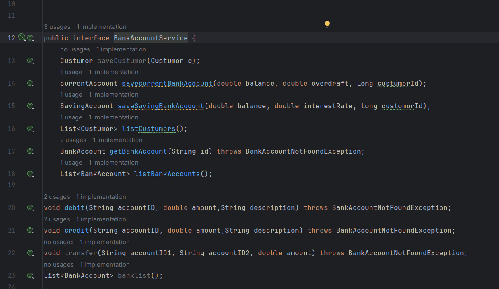

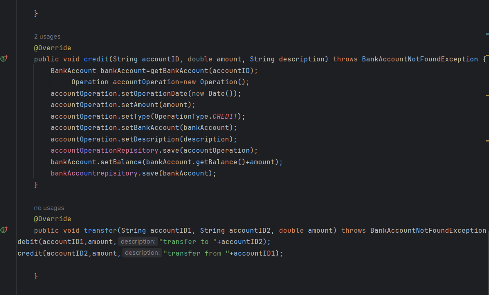

 RestController(WEB)

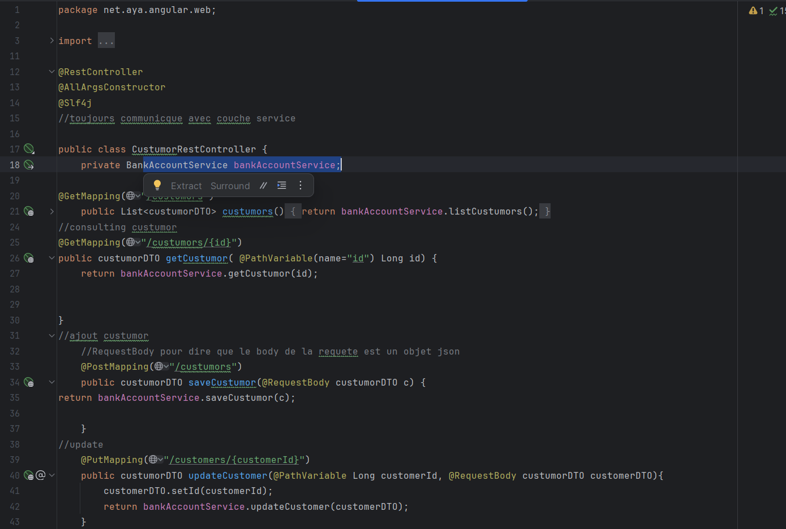

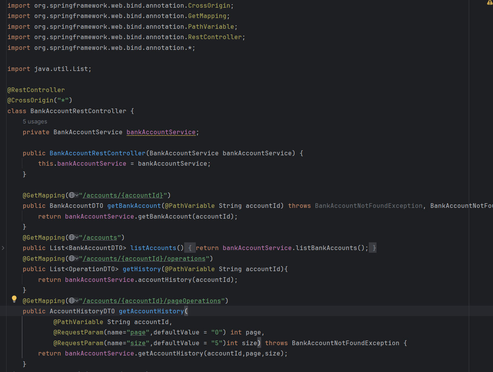

DTO
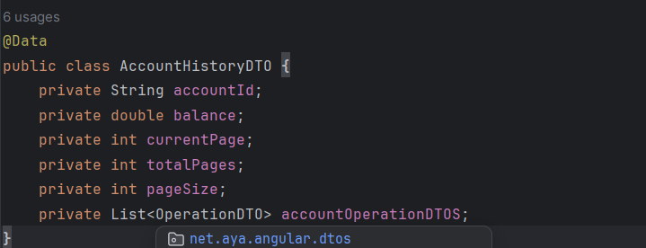
mappers

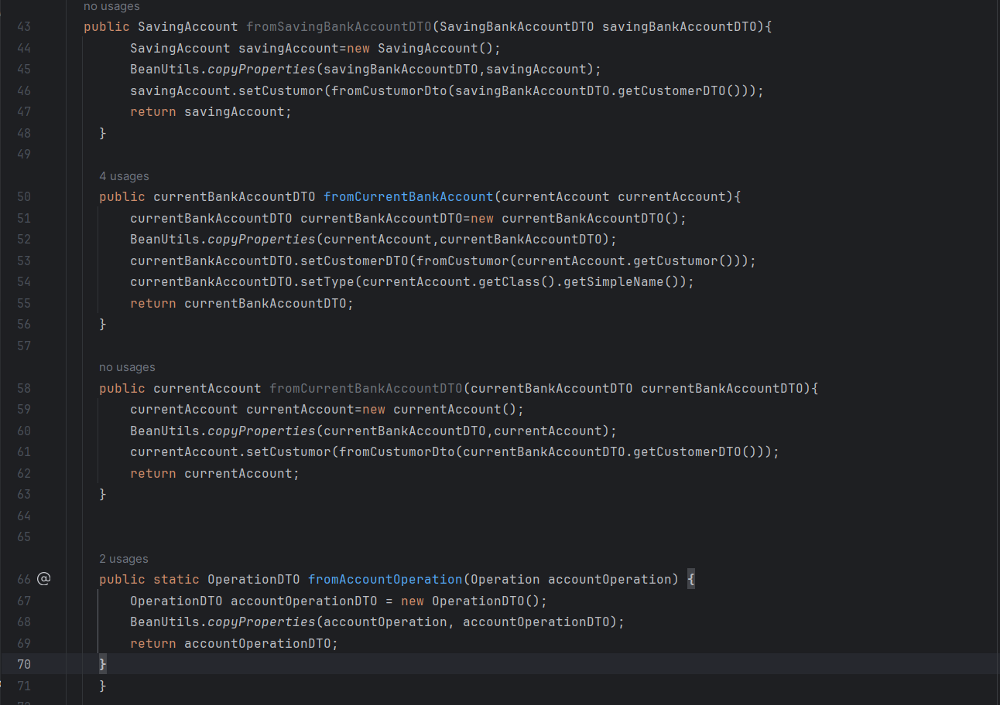
TEST

