Part1

1-
2-
savingaccount

operationtype
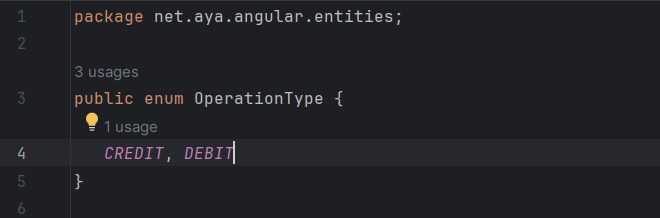
accountstatus

Current account
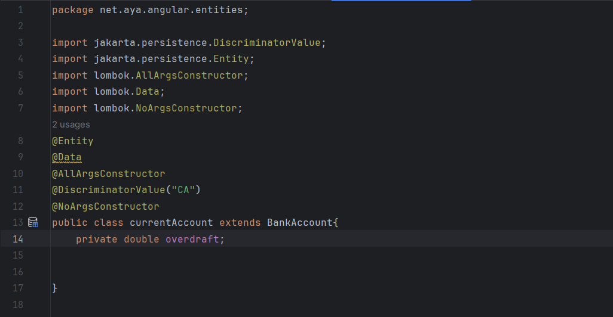
custumor

operation
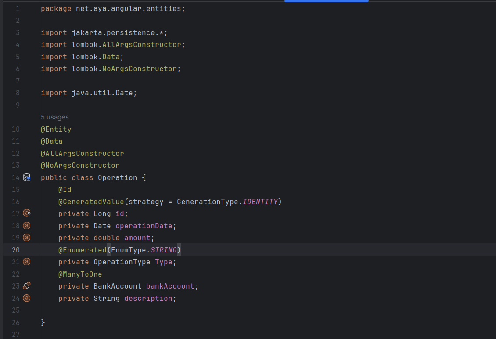
bankaccount

partie properties
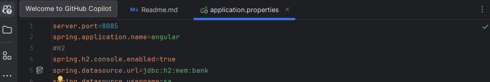
3-
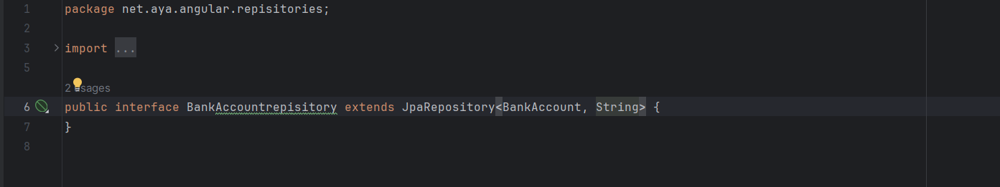
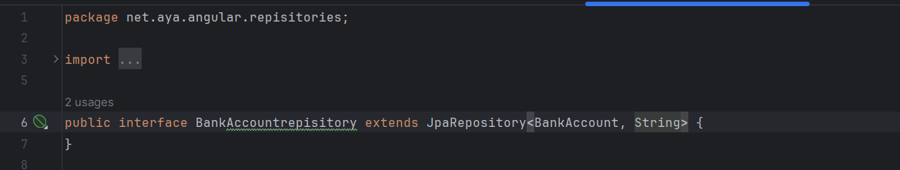

4-Test

<h2>dans H2</h2>
bankaccount
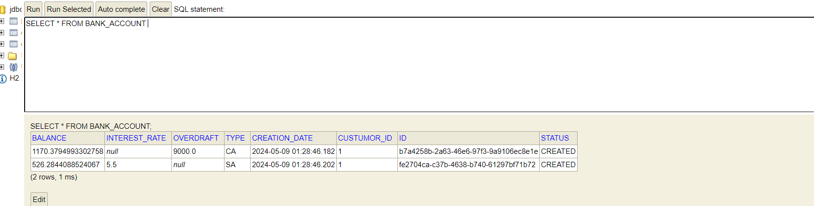
custumor
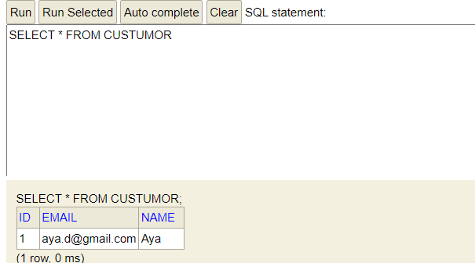
operation 
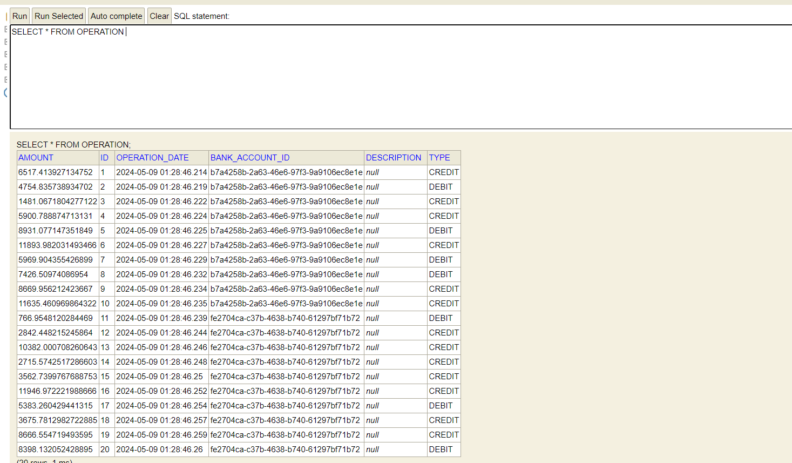
Avec SQL
partie properties
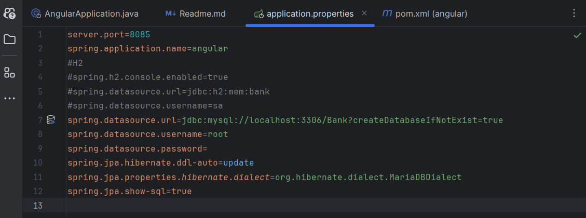
exec

bdd

<h1>Partie2</h1>
couche service

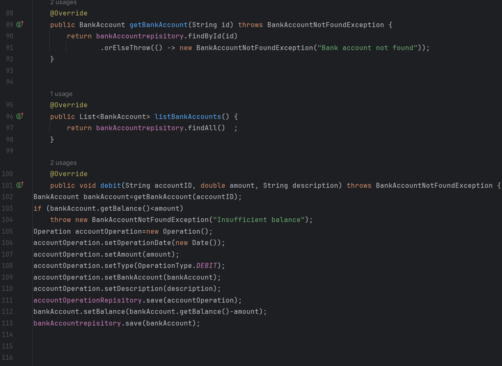

 RestController(WEB)

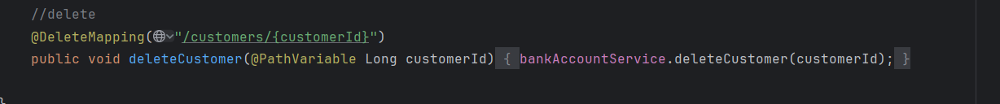

DTO

mappers
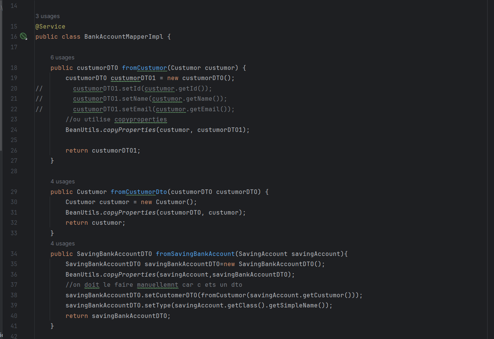

TEST
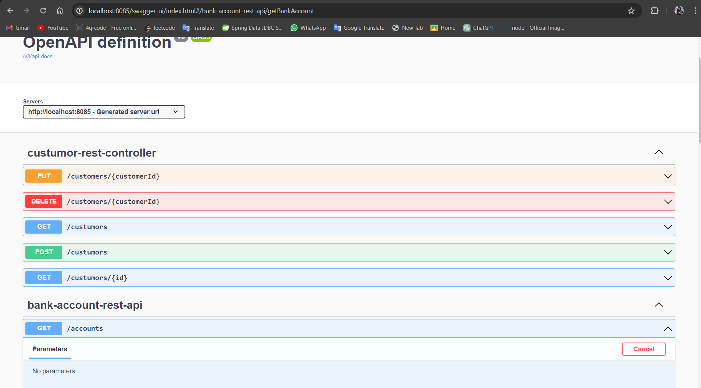

